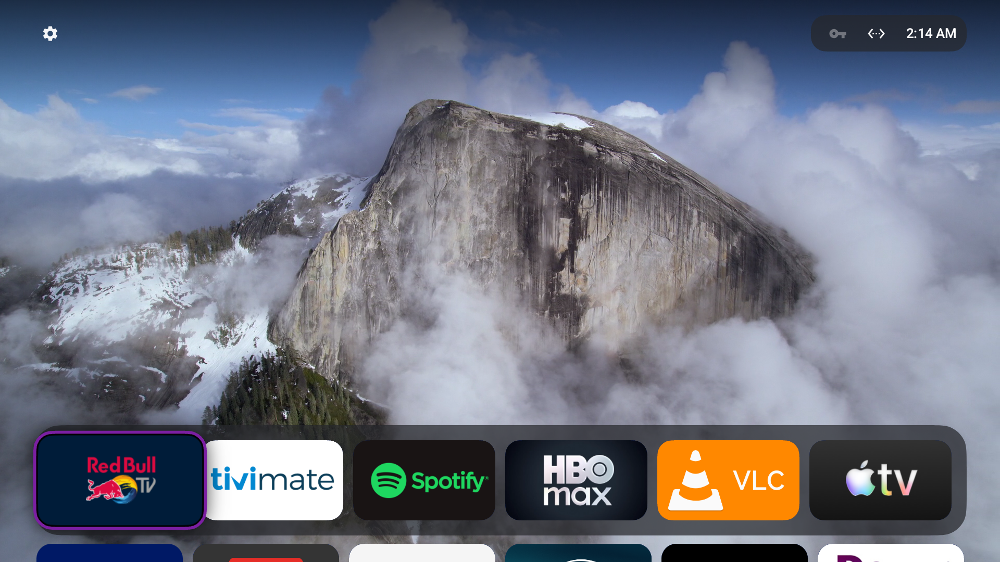
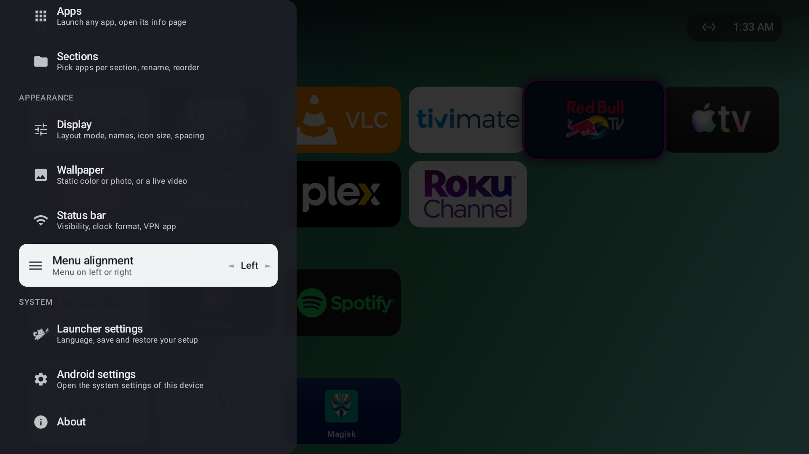
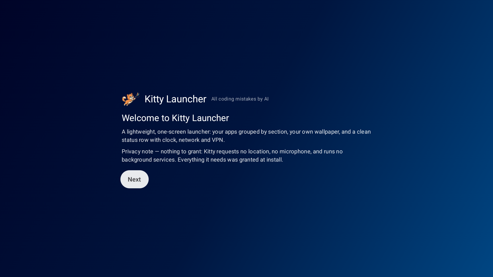

<a id="English"></a>
<div align="center">


# Kitty Launcher

**A fast, private, one-screen home launcher for Android TV & Google TV.**

Kitty Launcher is a fork of [Couchy Launcher](https://github.com/conreo/couchy-launcher), continuing development under a new name and with additional customizations.


[Contributing](CONTRIBUTING.md) · [Licensing](LICENSING.md)

<a href="https://givebutter.com/pflncdonation">
  
</a>

</div>

One screen, remote-driven, for 1080p and 4K TVs. No network requests out of the box — the wallpaper is a local gradient and settings live in a single file on the device.

| Live aerial wallpaper | Settings | First-run wizard |
|:---:|:---:|:---:|
|  |  |  |

---

## Features

- **Three layouts** — Carousel, Grid, or a floating glass Dock (press **Down** to expand to the full grid).
- **Sections** you rename, reorder and fill. Newly installed apps go to the first section.
- **Wallpapers** — gradients, your own photo, a looping video, or optional built-in aerial videos (Apple / Amazon / community, streamed only when enabled), with speed control and cross-fades.
- **Save & load** your full configuration — categories, layout, wallpaper, and all settings — as a JSON file.
- **Adjustable** icon size, spacing, corner roundness, interface scale, dimming, and an optional glass status-bar panel.
- **Status row** — clock, network state, optional VPN button.
- **D-pad only** — text entry happens only inside dialogs.
- **17 languages** (+ English), auto-selected from your system language:
  العربية · Deutsch · Español · Français · हिन्दी · Bahasa Indonesia · Italiano · 日本語 · 한국어 · Nederlands · Polski · Português · Русский · ไทย · Türkçe · Tiếng Việt · 中文.

---

## ⚠️ Aerial wallpaper notice

The built-in aerial video wallpapers are **opt-in and off by default**. When enabled, they stream public video files from **Apple** and **Amazon** CDNs — these are non-free, third-party services. No credentials or private data are sent, but the network traffic goes to proprietary infrastructure. If you want a fully libre setup, use the gradient, photo, or local video wallpaper options instead.

---

## Requirements

- **Android TV or Google TV** (requires the `leanback` feature — it won't install on phones/tablets).
- **Android 5.0 (Lollipop) or newer** — the whole Android TV lineage.
- **ARM (32- or 64-bit) or x86** — one universal APK covers every box, old and new.
- **No dependencies** — no companion app and **no Google Play Services** required; runs on AOSP boxes too.
- Driven entirely by the **remote / D-pad**; no touchscreen needed.

---

## Install

**1. Enable ADB debugging on the TV**

- `Settings → System → About →` click **Android TV OS build** 7 times
- `Settings → System → Developer options →` enable **USB / Wireless debugging**

**2. Connect and install from your computer** (TV IP is under `Settings → Network`):

```sh
adb connect <tv-ip>:5555
adb install -r Kitty-launcher.apk
```

Building from source instead: see [CONTRIBUTING.md](CONTRIBUTING.md).

---

## Set as default launcher

**Generic Android TV / AOSP boxes** — press **Home**, pick **Kitty Launcher**, choose **Always**.

**Certified Google TV** — Google blocks the on-screen home picker, so set it once over ADB:

```sh
adb shell cmd package set-home-activity com.rws.kittylauncher/.MainActivity
```

<details>
<summary><b>Stock launcher still taking over?</b></summary>

<br>

Check which launcher grabs **Home**:

```sh
adb shell cmd package resolve-activity -a android.intent.action.MAIN -c android.intent.category.HOME
```

Disable whichever package it reports (reversible with `adb shell pm enable <package>`) — the usual suspects:

```sh
adb shell pm disable-user --user 0 com.google.android.apps.tv.launcherx      # Google TV
adb shell pm disable-user --user 0 com.google.android.tvlauncher             # Android TV
adb shell pm disable-user --user 0 com.google.android.tungsten.setupwraith   # setup/recovery
```

Re-check; if another launcher takes over, disable that one too, until **Home** lands on Kitty.

</details>

The built-in setup wizard walks through this with your TV's IP pre-filled. No computer? It also offers a button-remap method (map **Home** to Kitty with an app like Button Mapper).

---

## Privacy

No ads, analytics, accounts or background services. The only network use is optional aerial-video streaming, off by default. Sections, ordering, hidden apps and wallpaper stay in one local file.

## Changelog

<details>
<summary>Click to expand</summary>


**v1.0.0**
- Initial release of Kitty Launcher, forked from Couchy Launcher v1.0.6.
- Rebranded and customized as Kitty Launcher.
- Added ...
</details>

## License

**GNU GPLv3** — free, open source, copyleft. See [LICENSING.md](LICENSING.md) for the app, artwork and bundled libraries.

## Contributing & translations

See [CONTRIBUTING.md](CONTRIBUTING.md). Adding a language is copying `values/strings.xml` to `values-<lang>/` and translating the values.

<br>

---